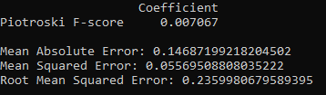
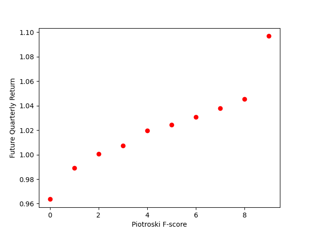
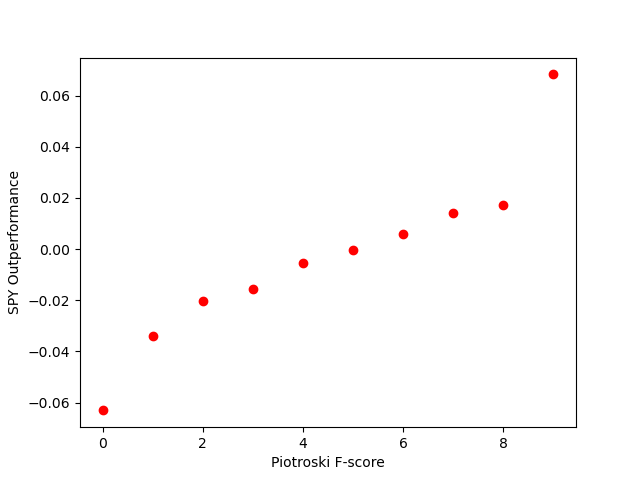
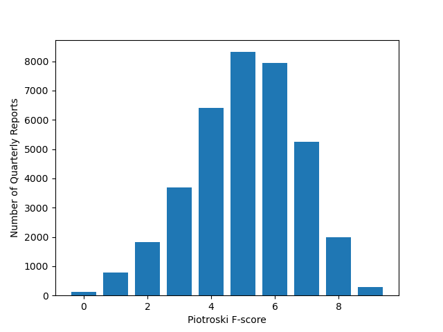

# Stock Market Predictor
## Project Introduction

This project utilizes quarterly financial data for a stock to predict returns for the forward quarter. The primary metric used in the prediction analysis was the Pietroski F-Score which is explained in greater detail here (https://en.wikipedia.org/wiki/Piotroski_F-score).

## Data Collection

Data was collecting using the us-derived-quarterly.csv and us-shareprices-daily.csv files from SimFin. I have not included those in this repository due to their large file sizes.

The data was refined using CSVreader.py which parsed thorough these files and created the output.txt file which contains quarterly info on each line for a specific stock.

OutputEditor.py was used to refine the data further by creating another file, outputUpdated.txt, which has some other financial metrics added to each line. OutputEditor.py was also used to refine data from SPY.csv in order to create SPYcomparison.txt which is used to compare quarterly returns for a specific stock to the return of the SPDR S&P 500 ETF Trust (SPY) for the same time period. SPY was used as a comparison since it generally tracks the broader US market. 

## Results

A regression analysis was done in order to determine the relationship between a company's Piotrski F-score and the future returns of said company.

Based on the results, there is a clear positive correlation (albeit a weak one based on the 0.24 n2 value) between these two metrics. In general, for every additional point on the Piotroski F-score, a company can be expected to get 0.71% additional returns for the forward quarter.

The positive correlation can be further seen in the graphs below which shows the average forward quarter returns for each F-score.

However, this data isn't partuclarly useful on it's own and needs to be compared to the returns from SPY to guage outperformance (or underperformance) of the broader market. The data that jumps out on first glance are the edge cases, companies with F-scores of 0 or 9. The 0 group vastly underperformed the broader market, indicating that this score is a good indicator of failing businesses. On the flip side, the 9 group vastly outperformed the broader market, indicating that this score is a good indicator of thriving businesses.

The following graph is also somewhat useful to conceptualize the relative frequencies of each F-score. A general bell curve pattern is evident with a F-score of 9 being quite rare, which is expected since the vast majority of companies cannot significantly beat the market.

## Conclusions
Based on the results, the Piotroski F-score seems to be a relatively useful metric for judging future stock performance. While the correlation is weak, this is somewhat expected since the stock market is highly unpredictable so a single metric (even one comprised of multiple indicators) is not expected to correlate highly.

## Future Work
Improving the regression analysis by looking at other financial metrics could potentially improve the correlation coefficient. I analysed a few (including current ratio and debt ratio) and was not able to improve it significantly but I'm sure it is possible.

My data also only goes back to about 2012 so further backtesting with older stock data would be useful.

## Built With
* Atom - Source code editor used for development
* Scikit-learn - Python library used for regression analysis
* Matplotlib - Python library used for data visualization

## Authors
Rohan Murthy  
